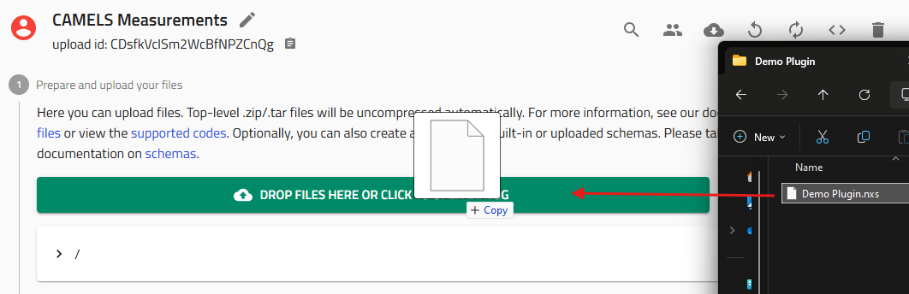
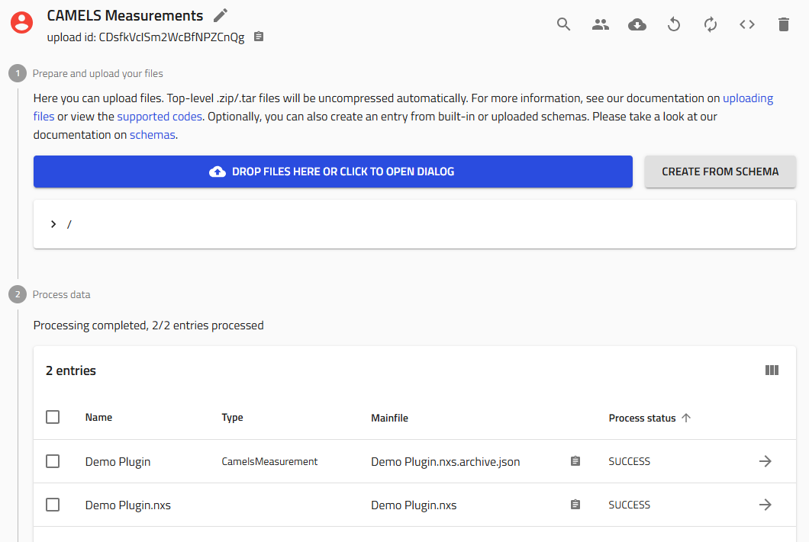
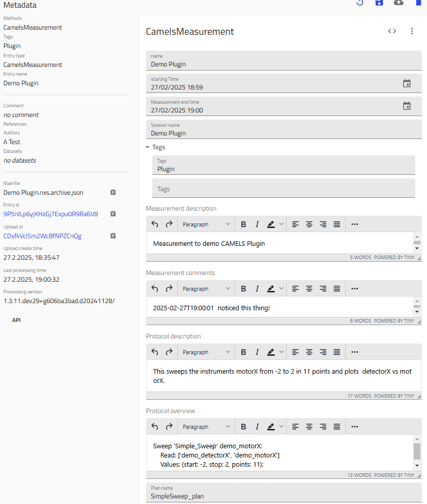
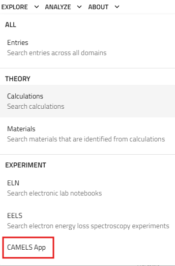
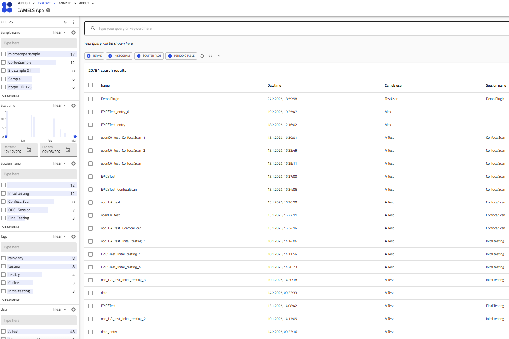

# How to Use This Plugin

This plugin can be used in a NOMAD Oasis installation. Follow the instruction [here](how_to/install_this_plugin.md) to use the plugin in your NOMAD Oasis installation.

## 1. Create a CAMELS Measurement File

There are two ways you can upload a CAMELS file to NOMAD:

### 1.1 Manual File Upload

Use NOMAD CAMELS to perform a measurement and create a datafile. This datafile has a `.nxs` file ending. 
You can upload this file manually by dragging and droping the file into an upload.

### 1.2 Automatic Upload

You can login to NOMAD within CAMELS and then choose `auto-upload` and select the correct `upload` you want to upload to.
Every measurement will then be automatically uploaded to the given `upload`.

## 2. Processed Files

After uploading your CAMELS file you should see two files. One is the raw `.nxs` file and one is the `.archive.json`.

!!! note "Relevant File"
The relevant file is the `.archive.json` file of type `CamelsMeasurement`.

## 3. Contents of the `CamelsMeasurement` File

The `CamelsMeasurement` file contains all relevant information saved by CAMELS during the measurement. 

Here is an example of what this could look like:

## 4. Browse Measurements in the CAMELS App

Finding your measurement files can be quite difficult. The CAMELS App makes this quite easy.

Simply navigate to `Explore > CAMELS App` 

On the left sidebar you can find all the available filters to filter and search through your measurements. In the center you will find all the `CamelsMeasurement` that match your fitlers and searches. 

Things you can search for:

- Sample: The sample you had selected in CAMELS while running the measurement
- Start time: The time you started the measurement
- Session name: Session name you entered in CAMELS
- Tags: Tags you added before you started the measurement
- User: Name of the user selected in CAMELS
- Instrument name: Names of the instruments that were used in the measurement script. 
- Custom quantities: You can sear **all** custom quantities with this filter. You can for example search for text you entered in the `measurement_description` or `protocol_description`. Enter "camels" in the `quantity` field to get a full list of searchable quantities. 

Here is an example of the app with several measurements.

